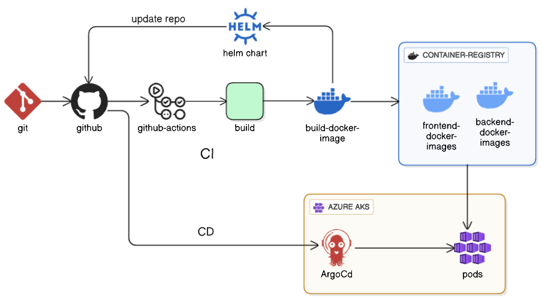

# 🚀 CI/CD Deployment of a 3-Tier Application to Azure Kubernetes with GitHub Actions, Argo CD, and Terraform

This project demonstrates a complete DevOps and GitOps pipeline that automates the build, deployment, and delivery of a cloud-native 3-tier application to Azure Kubernetes Service (AKS). It leverages industry-standard tools like GitHub Actions, Argo CD, Terraform, Helm, and Docker — integrated to deliver an end-to-end, production-grade workflow.

---

## 📌 Overview

The system is built around a modern microservices-style 3-tier architecture:

- **Frontend**: A Vite-based React.js web client
- **Backend**: A Spring Boot REST API
- **Database**: PostgreSQL running inside the AKS cluster

Each tier is containerized with Docker and deployed into a Kubernetes environment orchestrated by AKS. The system is designed to be modular, reproducible, and secure.

---

## 🔧 What This Project Covers

- ✅ **Infrastructure as Code** with Terraform to provision all Azure resources including:
  - Azure Kubernetes Service (AKS)
  - Azure Key Vault
  - Azure AD Service Principal

- ✅ **Continuous Integration (CI)** using GitHub Actions:
  - Separate workflows for `frontend/` and `backend/` directories
  - Builds Docker images
  - Pushes to Docker Hub
  - Updates Helm chart with new image tags

- ✅ **Continuous Delivery (CD)** using Argo CD:
  - Watches GitHub for changes to Helm chart
  - Automatically syncs and deploys to AKS
  - Self-healing and declarative application state

- ✅ **Security**:
  - Sensitive values managed in Azure Key Vault
  - No hardcoded credentials
  - Controlled RBAC for secrets access

---

## 📐 Pipeline architecture



The architecture follows a GitOps model where the Git repository is the source of truth. Any change to manifests, configurations, or image tags triggers automatic deployment via Argo CD.

---

## 🔨 Infrastructure Setup (Terraform)

The infrastructure is fully defined using Terraform and follows a modular structure. The modules include:

- `aks/` for creating the Kubernetes cluster
- `keyvault/` for managing secrets
- `service-principal/` to provision an identity with the required roles

Terraform manages provisioning of the Azure resources. You pass in values such as resource group, location, VM size, and Key Vault name via `terraform.tfvars`.

You’ll need:
- An Azure subscription
- Azure CLI installed and authenticated
- SSH key pair for connecting to nodes (even though we don’t log in directly)

Once configured, the usual flow is:

```bash
terraform init
terraform plan
terraform apply

